<!-- Upload README.md and the assets/ directory together. -->
<!-- Contact details come from the supplied README; no mockup metrics are included. -->

<picture>
  <source media="(max-width: 600px)" srcset="./assets/hero-mobile.png">
  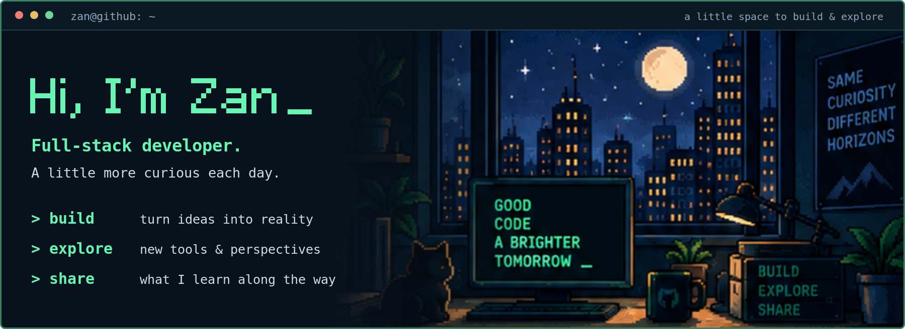
</picture>

<h3>
<picture>
  <source media="(prefers-color-scheme: dark)" srcset="./assets/about-dark.svg">
  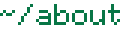
</picture>
</h3>

  <samp>
    I'm <strong>Zan</strong>, a full-stack developer working with <strong>TypeScript</strong>, <strong>Node.js</strong>, and the web. 
    I enjoy building useful things, exploring software architecture, and sharing what I learn.
  </samp>

<h3>
<picture>
  <source media="(prefers-color-scheme: dark)" srcset="./assets/stack-dark.svg">
  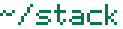
</picture>
</h3>

  <picture>
    <source media="(prefers-color-scheme: dark)" srcset="./assets/typescript-dark.svg">
    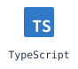
  </picture>
  <picture>
    <source media="(prefers-color-scheme: dark)" srcset="./assets/nodejs-dark.svg">
    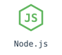
  </picture>
  <picture>
    <source media="(prefers-color-scheme: dark)" srcset="./assets/react-dark.svg">
    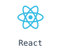
  </picture>
  <picture>
    <source media="(prefers-color-scheme: dark)" srcset="./assets/vue-dark.svg">
    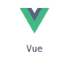
  </picture>
  <picture>
    <source media="(prefers-color-scheme: dark)" srcset="./assets/nextjs-dark.svg">
    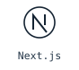
  </picture>
  <picture>
    <source media="(prefers-color-scheme: dark)" srcset="./assets/tailwind-dark.svg">
    
  </picture>
  <picture>
    <source media="(prefers-color-scheme: dark)" srcset="./assets/docker-dark.svg">
    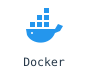
  </picture>
  <picture>
    <source media="(prefers-color-scheme: dark)" srcset="./assets/git-dark.svg">
    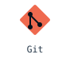
  </picture>

<samp>Also in the toolbox: MySQL · Redis · MongoDB · GraphQL · Linux.</samp>

<h3>
<picture>
  <source media="(prefers-color-scheme: dark)" srcset="./assets/writing-dark.svg">
  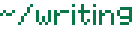
</picture>
</h3>

  <samp>
    Notes on web development, software architecture, and things learned by doing. 
    <a href="https://juejin.cn/user/2893570303354238">Read my articles on Juejin →</a>
  </samp>

 

<!-- Keep this image link free of inter-tag whitespace. -->

<a href="mailto:zandko@126.com"><picture><source media="(max-width: 800px) and (prefers-color-scheme: dark)" srcset="./assets/footer-mobile-dark.svg"><source media="(max-width: 800px)" srcset="./assets/footer-mobile-light.svg"><source media="(prefers-color-scheme: dark)" srcset="./assets/footer-dark.svg">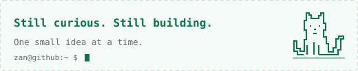</picture></a>

